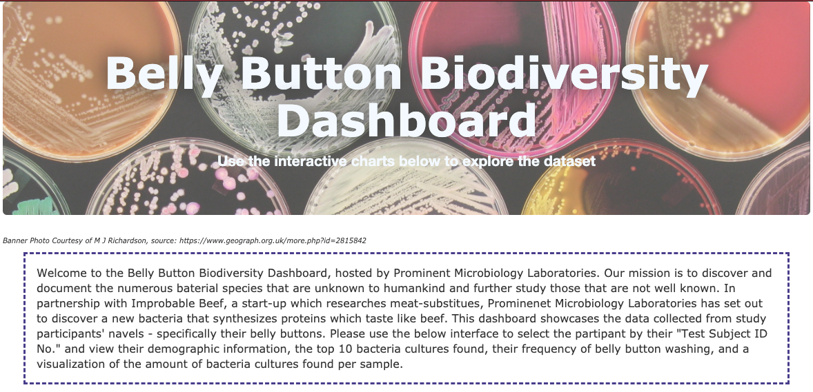
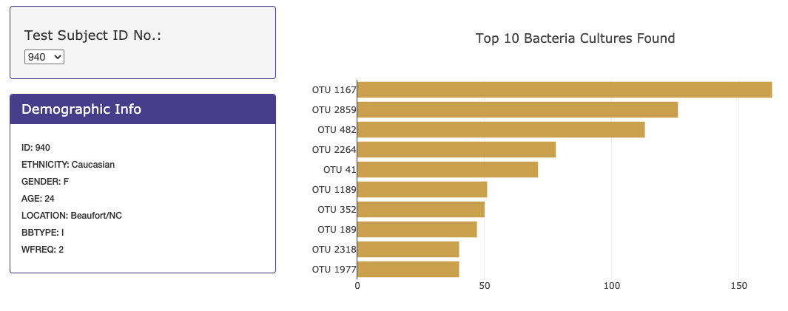
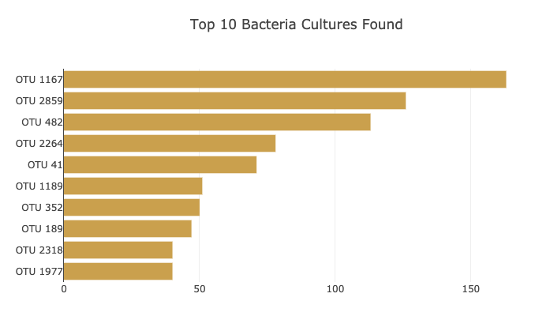
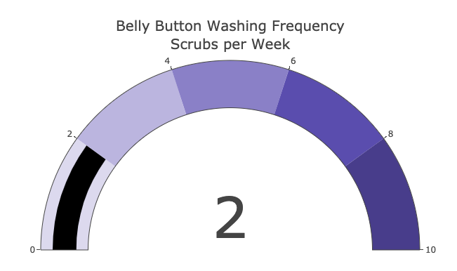
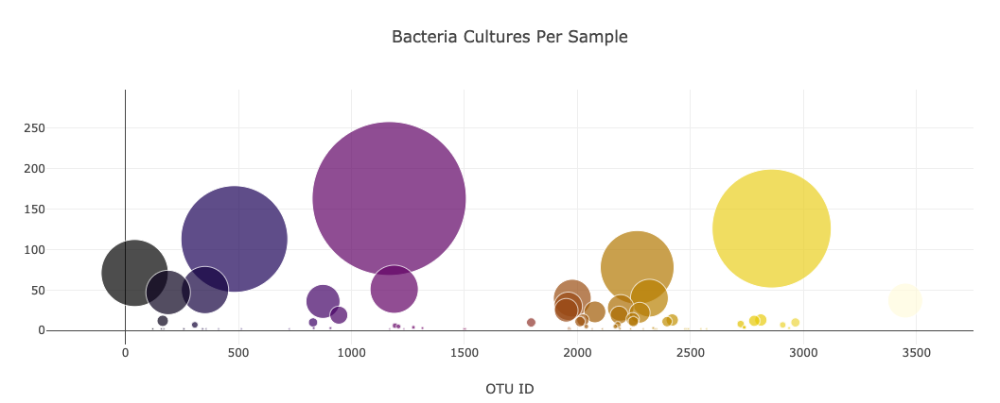

# Belly Button Biodiversity

## Overview of Project
This project will graph and visualize a dataset of bacterial samples collected from the navels of study participants and host the information on a HTML page that can be accessed broadly. 

### Purpose
In partnership with Improbably Beef, the purpose of this project is to discover a bacterium found in the human belly button that is capable of synthesizing proteins which taste like beef. The *Belly Button Biodiversity Dashboard* will allow participants, data researchers and enthusiasts to browse and view the details collected of each study participant, including their demographic information, the top 10 bacteria cultures found, their frequency of belly button washing, and a visualization of the number of bacteria cultures found per sample.

## Features
Upon arriving at the webpage, the user will find an eye-catching banner and an introduction of this project. The page defaults to the details of Participant ID: 940. 

__Figure 1 – *Belly Button Biodiversity Dashboard*__

Users can change which profile to view by using the drop-down selection provided in the *Participant Details Panel*. There are several graphics available, including a horizontal bar chart showing the *Top 10 Bacteria Cultures Found*.

__Figure 2 – *Participant Details*__/ __Figure 3 – *Top 10 Bacteria Cultures Found*__

 

An engaging variety of charts are used to display various data collections. A gauge will display how often the participant washes their belly button and a bubble chart will show the amount of each type of bacteria collected.

In general, the page was customized using a cohesive color-scheme and specific font selections that are pleasing to the eye. The visualizations are responsive and will scale with the size of the user’s browser. Sub-headings were added to highlight the various sections that exist.

__Figure 4 – *Gauge of Wash Frequency*__

__Figure 5 – *Amount of Bacteria Cultures per Sample*__

